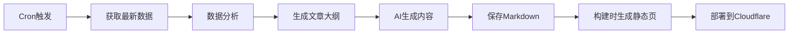

# 🚀 Alpha Arena Live 商业化实施方案

## 📊 当前状况分析

### 可用的 API 数据源

| API端点 | 数据类型 | 更新频率 | 商业价值 |
|---------|----------|----------|----------|
| `/api/leaderboard` | 排行榜 | 实时 | ⭐⭐⭐⭐⭐ 最核心 |
| `/api/analytics` | 综合分析 | 每小时 | ⭐⭐⭐⭐⭐ 最详细 |
| `/api/trades` | 交易记录 | 实时 | ⭐⭐⭐⭐⭐ 历史数据 |
| `/api/analytics/{model}` | 单模型分析 | 每小时 | ⭐⭐⭐⭐ 深度分析 |
| `/api/conversations` | AI对话记录 | 实时 | ⭐⭐⭐⭐ 决策过程 |
| `/api/account-totals` | 账户总额 | 实时 | ⭐⭐⭐ 资金追踪 |
| `/api/since-inception-values` | 自启动数据 | 每日 | ⭐⭐⭐ 长期趋势 |
| `/api/crypto-prices` | 加密货币价格 | 实时 | ⭐⭐ 辅助数据 |

### 技术栈现状
- ✅ **前端**: Next.js 14 + React + TypeScript
- ✅ **部署**: Cloudflare Workers (边缘计算)
- ✅ **数据库**: Supabase (PostgreSQL)
- ✅ **AI生成**: OpenRouter API

---

## 🎯 商业化目标

### 第一阶段（1-2个月）：内容与流量
1. 打造内容丰富的首页和LIVE页面
2. 每日自动生成高质量分析文章
3. 建立完整的数据库，存储所有历史数据
4. SEO优化，获取自然流量

### 第二阶段（2-4个月）：付费内容
1. 推出付费API服务
2. 提供高级数据分析报告
3. 实时交易信号推送
4. 历史数据下载服务

### 第三阶段（4-6个月）：平台化
1. AI交易策略回测平台
2. 用户自定义警报系统
3. 社区论坛和讨论区
4. 联盟营销计划

---

## 🏗️ Cloudflare 生态系统数据库方案

### 推荐架构：Supabase + Cloudflare D1 混合方案

```
┌─────────────────────────────────────────────────────────┐
│                    Cloudflare Workers                    │
│                      (边缘计算层)                         │
└────────────┬──────────────────────────┬─────────────────┘
             │                          │
             ▼                          ▼
    ┌────────────────┐        ┌────────────────────┐
    │  Cloudflare D1 │        │    Supabase        │
    │   (SQLite)     │        │  (PostgreSQL)      │
    │                │        │                    │
    │ • 实时数据缓存  │        │ • 历史交易数据      │
    │ • 排行榜快照    │        │ • 文章内容         │
    │ • 最新100条交易 │        │ • 分析报告         │
    │ • 热点数据      │        │ • 用户数据         │
    └────────────────┘        │ • 完整analytics    │
                              └────────────────────┘
```

### 为什么选择混合方案？

#### Cloudflare D1 的优势
- ✅ **超低延迟**: 边缘节点就近访问（<50ms）
- ✅ **免费额度**: 每天500万次读取 + 10万次写入
- ✅ **自动扩展**: 无需配置，自动全球分发
- ✅ **完美集成**: 与 Workers 无缝配合

#### Supabase 的优势
- ✅ **成熟的 PostgreSQL**: 复杂查询和关系型数据
- ✅ **实时订阅**: WebSocket 实时数据推送
- ✅ **完整功能**: 认证、存储、边缘函数
- ✅ **已有集成**: 现有代码直接使用

#### 数据分层策略

**热数据（Cloudflare D1）**：
- 最新排行榜（缓存5分钟）
- 最近100笔交易
- 实时价格快照
- 今日统计数据

**冷数据（Supabase）**：
- 历史交易记录（完整）
- 所有文章内容
- 用户账户和订阅
- 完整分析数据

---

## 📦 数据库 Schema 设计

### Supabase 表结构

```sql
-- ========================================
-- 1. 交易记录表（完整历史）
-- ========================================
CREATE TABLE trades (
  id TEXT PRIMARY KEY,
  trade_id TEXT UNIQUE NOT NULL,

  -- 基本信息
  symbol TEXT NOT NULL,
  side TEXT NOT NULL, -- 'long' | 'short'
  trade_type TEXT NOT NULL,
  model_id TEXT NOT NULL,
  quantity DECIMAL(20, 10) NOT NULL,
  leverage DECIMAL(5, 2) NOT NULL,
  confidence DECIMAL(5, 4),

  -- 入场数据
  entry_time BIGINT NOT NULL,
  entry_human_time TIMESTAMP NOT NULL,
  entry_price DECIMAL(20, 10) NOT NULL,
  entry_sz DECIMAL(20, 10) NOT NULL,
  entry_tid BIGINT,
  entry_oid BIGINT,
  entry_crossed BOOLEAN,
  entry_commission_dollars DECIMAL(20, 10),
  entry_closed_pnl DECIMAL(20, 10),

  -- 出场数据
  exit_time BIGINT,
  exit_human_time TIMESTAMP,
  exit_price DECIMAL(20, 10),
  exit_sz DECIMAL(20, 10),
  exit_tid BIGINT,
  exit_oid BIGINT,
  exit_crossed BOOLEAN,
  exit_commission_dollars DECIMAL(20, 10),
  exit_closed_pnl DECIMAL(20, 10),

  -- 盈亏统计
  realized_gross_pnl DECIMAL(20, 10),
  realized_net_pnl DECIMAL(20, 10),
  total_commission_dollars DECIMAL(20, 10),

  -- 元数据
  created_at TIMESTAMP DEFAULT NOW(),
  updated_at TIMESTAMP DEFAULT NOW(),

  -- 索引
  INDEX idx_model_id (model_id),
  INDEX idx_symbol (symbol),
  INDEX idx_entry_time (entry_time DESC),
  INDEX idx_trade_id (trade_id)
);

-- ========================================
-- 2. 排行榜快照表（每小时快照）
-- ========================================
CREATE TABLE leaderboard_snapshots (
  id BIGSERIAL PRIMARY KEY,
  snapshot_time TIMESTAMP NOT NULL,

  -- 模型信息
  model_id TEXT NOT NULL,

  -- 排行榜数据
  num_trades INTEGER NOT NULL,
  sharpe DECIMAL(10, 4),
  win_dollars DECIMAL(20, 10),
  num_losses INTEGER,
  lose_dollars DECIMAL(20, 10),
  return_pct DECIMAL(10, 4),
  equity DECIMAL(20, 10),
  num_wins INTEGER,

  -- 排名
  rank INTEGER,

  -- 元数据
  created_at TIMESTAMP DEFAULT NOW(),

  -- 索引
  INDEX idx_snapshot_time (snapshot_time DESC),
  INDEX idx_model_snapshot (model_id, snapshot_time DESC),
  UNIQUE (model_id, snapshot_time)
);

-- ========================================
-- 3. 分析数据表（详细指标）
-- ========================================
CREATE TABLE analytics_snapshots (
  id BIGSERIAL PRIMARY KEY,
  snapshot_time TIMESTAMP NOT NULL,
  model_id TEXT NOT NULL,

  -- Fee & PnL Breakdown
  std_net_pnl DECIMAL(20, 10),
  total_fees_paid DECIMAL(20, 10),
  overall_pnl_without_fees DECIMAL(20, 10),
  total_fees_as_pct_of_pnl DECIMAL(10, 4),
  overall_pnl_with_fees DECIMAL(20, 10),
  avg_taker_fee DECIMAL(20, 10),
  std_gross_pnl DECIMAL(20, 10),
  avg_net_pnl DECIMAL(20, 10),
  biggest_net_loss DECIMAL(20, 10),
  biggest_net_gain DECIMAL(20, 10),
  avg_gross_pnl DECIMAL(20, 10),
  std_taker_fee DECIMAL(20, 10),

  -- Winners & Losers
  win_rate DECIMAL(5, 4),
  avg_winners_net_pnl DECIMAL(20, 10),
  avg_losers_net_pnl DECIMAL(20, 10),
  avg_winners_notional DECIMAL(20, 10),
  avg_losers_notional DECIMAL(20, 10),
  avg_winners_holding_period DECIMAL(20, 10),
  avg_losers_holding_period DECIMAL(20, 10),

  -- 原始JSON数据（完整保存）
  raw_data JSONB,

  -- 元数据
  created_at TIMESTAMP DEFAULT NOW(),

  -- 索引
  INDEX idx_analytics_time (snapshot_time DESC),
  INDEX idx_analytics_model (model_id, snapshot_time DESC),
  UNIQUE (model_id, snapshot_time)
);

-- ========================================
-- 4. AI对话记录表
-- ========================================
CREATE TABLE ai_conversations (
  id TEXT PRIMARY KEY,
  model_id TEXT NOT NULL,
  conversation_time TIMESTAMP NOT NULL,

  -- 对话内容
  user_prompt TEXT,
  ai_response TEXT,

  -- 决策相关
  decision_type TEXT, -- 'entry' | 'exit' | 'hold'
  symbol TEXT,
  action_taken TEXT,
  confidence DECIMAL(5, 4),

  -- 原始数据
  raw_data JSONB,

  -- 元数据
  created_at TIMESTAMP DEFAULT NOW(),

  -- 索引
  INDEX idx_conversation_time (conversation_time DESC),
  INDEX idx_conversation_model (model_id, conversation_time DESC)
);

-- ========================================
-- 5. 生成文章表（已存在，保持不变）
-- ========================================
-- 使用现有的 articles 表或文件系统

-- ========================================
-- 6. 付费用户表（商业化）
-- ========================================
CREATE TABLE users (
  id UUID PRIMARY KEY DEFAULT uuid_generate_v4(),
  email TEXT UNIQUE NOT NULL,
  username TEXT UNIQUE,

  -- 订阅信息
  subscription_tier TEXT DEFAULT 'free', -- 'free' | 'pro' | 'enterprise'
  subscription_status TEXT DEFAULT 'active',
  subscription_start_date TIMESTAMP,
  subscription_end_date TIMESTAMP,

  -- API访问
  api_key TEXT UNIQUE,
  api_calls_count INTEGER DEFAULT 0,
  api_calls_limit INTEGER DEFAULT 100, -- 每日限制

  -- 元数据
  created_at TIMESTAMP DEFAULT NOW(),
  updated_at TIMESTAMP DEFAULT NOW(),
  last_login_at TIMESTAMP,

  -- 索引
  INDEX idx_email (email),
  INDEX idx_api_key (api_key)
);

-- ========================================
-- 7. API调用日志表（商业化追踪）
-- ========================================
CREATE TABLE api_usage_logs (
  id BIGSERIAL PRIMARY KEY,
  user_id UUID REFERENCES users(id),

  -- 请求信息
  endpoint TEXT NOT NULL,
  method TEXT NOT NULL,
  query_params JSONB,

  -- 响应信息
  response_status INTEGER,
  response_time_ms INTEGER,
  data_returned_bytes INTEGER,

  -- 计费信息
  credits_used DECIMAL(10, 4) DEFAULT 1,

  -- 元数据
  created_at TIMESTAMP DEFAULT NOW(),
  ip_address INET,
  user_agent TEXT,

  -- 索引
  INDEX idx_user_usage (user_id, created_at DESC),
  INDEX idx_endpoint_usage (endpoint, created_at DESC)
);
```

### Cloudflare D1 表结构（缓存层）

```sql
-- 排行榜缓存（5分钟刷新）
CREATE TABLE leaderboard_cache (
  model_id TEXT PRIMARY KEY,
  num_trades INTEGER,
  sharpe REAL,
  win_dollars REAL,
  num_losses INTEGER,
  lose_dollars REAL,
  return_pct REAL,
  equity REAL,
  num_wins INTEGER,
  rank INTEGER,
  cached_at INTEGER -- Unix timestamp
);

-- 最新交易缓存（最近100条）
CREATE TABLE recent_trades_cache (
  id TEXT PRIMARY KEY,
  trade_data TEXT, -- JSON string
  entry_time INTEGER,
  model_id TEXT,
  cached_at INTEGER
);
CREATE INDEX idx_recent_trades_time ON recent_trades_cache(entry_time DESC);
```

---

## 🔄 数据采集与同步策略

### 1. Cloudflare Cron Triggers 设置

```toml
# wrangler.toml
[triggers]
# 每5分钟同步实时数据到D1缓存
crons = ["*/5 * * * *"]

# 或更细化：
# crons = [
#   "*/5 * * * *",    # 实时数据同步（leaderboard, trades）
#   "0 * * * *",      # 每小时同步analytics
#   "0 0 * * *"       # 每天生成文章
# ]
```

### 2. 数据同步脚本架构

```typescript
// src/app/api/cron/sync-data/route.ts
export async function GET(request: NextRequest) {
  // 验证Cron Secret
  const authHeader = request.headers.get('authorization')
  if (authHeader !== `Bearer ${process.env.CRON_SECRET}`) {
    return NextResponse.json({ error: 'Unauthorized' }, { status: 401 })
  }

  try {
    // 并行执行多个同步任务
    const results = await Promise.allSettled([
      syncLeaderboard(),
      syncTrades(),
      syncAnalytics(),
      updateD1Cache(),
    ])

    return NextResponse.json({
      success: true,
      results: results.map(r => r.status),
      timestamp: new Date().toISOString()
    })
  } catch (error) {
    return NextResponse.json({ error: error.message }, { status: 500 })
  }
}

// 同步排行榜
async function syncLeaderboard() {
  const response = await fetch('https://nof1.ai/api/leaderboard')
  const data = await response.json()

  // 保存到Supabase（历史快照）
  await supabase.from('leaderboard_snapshots').insert(
    data.leaderboard.map((item, index) => ({
      snapshot_time: new Date(),
      model_id: item.id,
      rank: index + 1,
      ...item
    }))
  )

  // 更新D1缓存（实时数据）
  for (const [index, item] of data.leaderboard.entries()) {
    await env.DB.prepare(`
      INSERT OR REPLACE INTO leaderboard_cache VALUES (?, ?, ?, ?, ?, ?, ?, ?, ?, ?, ?)
    `).bind(
      item.id, item.num_trades, item.sharpe, item.win_dollars,
      item.num_losses, item.lose_dollars, item.return_pct,
      item.equity, item.num_wins, index + 1, Date.now()
    ).run()
  }
}

// 同步交易记录
async function syncTrades() {
  const response = await fetch('https://nof1.ai/api/trades')
  const data = await response.json()

  // 获取已有的trade_id
  const { data: existingTrades } = await supabase
    .from('trades')
    .select('trade_id')

  const existingIds = new Set(existingTrades?.map(t => t.trade_id) || [])

  // 只插入新交易
  const newTrades = data.trades.filter(t => !existingIds.has(t.trade_id))

  if (newTrades.length > 0) {
    await supabase.from('trades').insert(newTrades.map(trade => ({
      id: trade.id,
      trade_id: trade.trade_id,
      // ... 映射所有字段
    })))
  }

  return { new_trades: newTrades.length }
}

// 同步分析数据
async function syncAnalytics() {
  const response = await fetch('https://nof1.ai/api/analytics')
  const data = await response.json()

  await supabase.from('analytics_snapshots').insert(
    data.analytics.map(item => ({
      snapshot_time: new Date(data.serverTime),
      model_id: item.model_id,
      // 提取关键指标
      win_rate: item.winners_losers_breakdown_table?.win_rate,
      avg_net_pnl: item.fee_pnl_moves_breakdown_table?.avg_net_pnl,
      // ... 其他字段
      raw_data: item // 保存完整JSON
    }))
  )
}
```

---

## 📝 内容生成系统设计

### 自动文章生成流程



### 文章类型规划

#### 1. 每日交易报告（Daily Report）
**频率**: 每天 1 篇
**内容**:
- 今日排行榜变化
- 各模型交易统计
- 最大盈利/亏损交易
- 市场行情分析

**生成时间**: 每天 UTC 00:00（北京时间 08:00）

#### 2. 周度策略分析（Weekly Strategy）
**频率**: 每周 1 篇
**内容**:
- 本周胜率最高模型
- 策略模式分析
- 长线 vs 短线对比
- 风险管理洞察

**生成时间**: 每周一 UTC 00:00

#### 3. 模型深度分析（Model Deep Dive）
**频率**: 每周 2-3 篇
**内容**:
- 单个模型完整表现
- 交易风格特征
- 决策过程分析（基于conversations）
- 优化建议

#### 4. 市场洞察（Market Insights）
**频率**: 根据市场波动触发
**触发条件**:
- 某模型收益率变化 > 10%
- 市场极端波动
- 新的交易模式出现

### 文章生成脚本

```typescript
// scripts/generate-daily-report.ts
import { OpenAI } from 'openai'
import fs from 'fs'
import path from 'path'

async function generateDailyReport() {
  // 1. 获取今日数据
  const leaderboard = await fetchLeaderboard()
  const todayTrades = await fetchTodayTrades()
  const analytics = await fetchAnalytics()

  // 2. 数据分析
  const topPerformer = leaderboard[0]
  const totalTrades = todayTrades.length
  const totalPnL = todayTrades.reduce((sum, t) => sum + t.realized_net_pnl, 0)

  // 3. 构建提示词
  const prompt = `
作为一位专业的加密货币交易分析师，请基于以下数据生成一篇深度分析文章：

# 今日数据概览
- 总交易数: ${totalTrades}
- 总盈亏: $${totalPnL.toFixed(2)}
- 最佳表现: ${topPerformer.id} (收益率: ${topPerformer.return_pct}%)

# 排行榜数据
${JSON.stringify(leaderboard, null, 2)}

# 交易记录
${JSON.stringify(todayTrades.slice(0, 10), null, 2)}

请生成一篇结构化的分析文章，包括：
1. 执行摘要
2. 排行榜变化分析
3. 交易策略洞察
4. 风险提示
5. 明日展望

使用Markdown格式，包含标题、列表、表格。
`

  // 4. AI生成内容
  const openai = new OpenAI({
    baseURL: 'https://openrouter.ai/api/v1',
    apiKey: process.env.OPENROUTER_API_KEY,
  })

  const completion = await openai.chat.completions.create({
    model: 'anthropic/claude-3.5-sonnet',
    messages: [{ role: 'user', content: prompt }],
    temperature: 0.7,
  })

  const content = completion.choices[0].message.content

  // 5. 生成Frontmatter
  const today = new Date().toISOString().split('T')[0]
  const slug = `daily-report-${today}`

  const markdown = `---
title: "Alpha Arena 每日交易报告 - ${today}"
excerpt: "${topPerformer.id} 以 ${topPerformer.return_pct}% 的收益率领跑，共执行 ${totalTrades} 笔交易"
category: "daily-report"
tags: ["daily", "trading", "analysis", "${topPerformer.id}"]
publishedAt: "${new Date().toISOString()}"
readTime: 8
---

${content}
`

  // 6. 保存文件
  const filePath = path.join(process.cwd(), 'content/articles', `${slug}.md`)
  fs.writeFileSync(filePath, markdown, 'utf8')

  console.log(`✅ Generated article: ${slug}`)
}

generateDailyReport()
```

---

## 🎨 首页和LIVE页面设计方案

### 首页（Homepage）重新设计

```tsx
// src/app/page.tsx
export default function HomePage() {
  return (
    <>
      {/* Hero Section - 实时排行榜 */}
      <section className="hero">
        <h1>AI Trading Competition Live Tracker</h1>
        <LiveLeaderboard /> {/* 从D1缓存加载，<50ms */}
      </section>

      {/* Real-time Stats */}
      <section className="stats-grid">
        <StatCard title="Total Trades Today" value="1,247" />
        <StatCard title="Total P&L" value="+$12,456" />
        <StatCard title="Best Performer" value="qwen3-max" />
        <StatCard title="Win Rate" value="64.3%" />
      </section>

      {/* 实时交易流 */}
      <section className="live-trades">
        <h2>Recent Trades</h2>
        <TradesFeed /> {/* WebSocket实时更新 */}
      </section>

      {/* 最新文章 */}
      <section className="latest-articles">
        <h2>Latest Analysis</h2>
        <ArticleGrid articles={latestArticles} />
      </section>

      {/* 性能对比图表 */}
      <section className="performance-charts">
        <EquityCurveChart />
        <WinRateComparison />
      </section>
    </>
  )
}
```

### LIVE页面（实时追踪）设计

```tsx
// src/app/live/page.tsx
export default function LivePage() {
  return (
    <>
      {/* 实时排行榜 */}
      <LiveLeaderboard />

      {/* 实时交易表格 */}
      <LiveTradesTable />

      {/* 价格图表 */}
      <PriceCharts symbols={['BTC', 'ETH', 'SOL']} />

      {/* AI决策日志 */}
      <AIDecisionLog />
    </>
  )
}

// 使用Supabase Realtime订阅
function LiveTradesTable() {
  const [trades, setTrades] = useState([])

  useEffect(() => {
    const channel = supabase
      .channel('trades')
      .on('postgres_changes', {
        event: 'INSERT',
        schema: 'public',
        table: 'trades'
      }, payload => {
        setTrades(prev => [payload.new, ...prev].slice(0, 100))
      })
      .subscribe()

    return () => supabase.removeChannel(channel)
  }, [])

  return <TradesTable trades={trades} />
}
```

---

## 💰 商业化API设计

### API层级定价

| 层级 | 价格 | 请求限制 | 功能 |
|------|------|----------|------|
| **Free** | $0/月 | 100次/天 | 基础排行榜、最新10笔交易 |
| **Pro** | $29/月 | 10,000次/天 | 完整历史数据、实时WebSocket |
| **Enterprise** | $299/月 | 无限制 | 所有功能、专属支持、白标 |

### API端点设计

```typescript
// 公开API（免费）
GET /api/v1/leaderboard
GET /api/v1/trades/recent?limit=10

// 付费API（需要API Key）
GET /api/v1/trades/history?from=2025-01-01&to=2025-01-31
GET /api/v1/analytics/{model_id}?timeframe=7d
GET /api/v1/trades/export?format=csv
GET /api/v1/signals/realtime (WebSocket)

// 请求头验证
Authorization: Bearer {api_key}
```

### API Gateway 实现

```typescript
// src/middleware.ts
export async function middleware(request: NextRequest) {
  const pathname = request.nextUrl.pathname

  // 如果是付费API路径
  if (pathname.startsWith('/api/v1/')) {
    const apiKey = request.headers.get('authorization')?.replace('Bearer ', '')

    if (!apiKey) {
      return NextResponse.json({ error: 'API key required' }, { status: 401 })
    }

    // 从D1查询用户信息（快速）
    const user = await env.DB.prepare(
      'SELECT * FROM users WHERE api_key = ?'
    ).bind(apiKey).first()

    if (!user) {
      return NextResponse.json({ error: 'Invalid API key' }, { status: 401 })
    }

    // 检查配额
    if (user.api_calls_count >= user.api_calls_limit) {
      return NextResponse.json({ error: 'Rate limit exceeded' }, { status: 429 })
    }

    // 记录API调用（异步，不阻塞）
    logApiCall(user.id, pathname)

    // 将用户信息添加到请求头
    request.headers.set('x-user-id', user.id)
  }

  return NextResponse.next()
}
```

---

## 📈 实施时间表

### Week 1-2: 数据基础设施
- [x] 创建Supabase表结构
- [ ] 设置Cloudflare D1数据库
- [ ] 实现数据同步脚本
- [ ] 配置Cron Triggers

### Week 3-4: 首页和LIVE页面
- [ ] 重新设计首页组件
- [ ] 实现实时数据展示
- [ ] 添加交互式图表
- [ ] 优化性能（D1缓存）

### Week 5-6: 内容生成系统
- [ ] 完善文章生成脚本
- [ ] 设置每日自动生成
- [ ] 优化AI提示词
- [ ] 添加多种文章类型

### Week 7-8: 商业化准备
- [ ] 实现用户认证系统
- [ ] 创建API Key管理
- [ ] 设置支付集成（Stripe）
- [ ] 实现API Gateway

### Week 9-10: 测试和优化
- [ ] 性能测试
- [ ] SEO优化
- [ ] 文档编写
- [ ] Beta用户测试

### Week 11-12: 正式发布
- [ ] 公开发布付费API
- [ ] 营销推广
- [ ] 监控和迭代

---

## 🎯 下一步行动

### 立即开始（优先级最高）

1. **创建Supabase表结构**
   ```bash
   # 在Supabase SQL Editor中执行schema
   ```

2. **完善数据同步脚本**
   ```bash
   # 创建完整的sync-all-data.ts
   pnpm create-sync-script
   ```

3. **设置Cloudflare Cron**
   ```bash
   # 配置自动执行
   ```

4. **优化首页展示**
   ```bash
   # 重新设计HomePage组件
   ```

### 成功指标

- ✅ 数据库中存储至少7天历史数据
- ✅ 每日自动生成1篇文章
- ✅ 首页加载时间 < 1秒
- ✅ API响应时间 < 200ms
- ✅ 月度独立访客 > 10,000

---

## 💡 商业化建议

### 收入模型
1. **API订阅**: 月度经常性收入（MRR）
2. **数据导出**: 一次性付费下载历史数据
3. **白标服务**: 为其他平台提供数据API
4. **广告**: Google AdSense + 直接广告销售
5. **联盟营销**: 交易所返佣

### 目标客户
- 加密货币交易者
- 量化基金
- AI研究人员
- 金融科技公司
- 新闻媒体

### 市场定位
> "实时追踪和分析AI交易竞赛的专业数据平台"

---

## 🔐 安全考虑

1. **API密钥管理**: 使用Cloudflare Workers Secrets
2. **速率限制**: Cloudflare Workers KV存储
3. **DDoS防护**: Cloudflare自动防护
4. **数据加密**: HTTPS + PostgreSQL加密
5. **访问日志**: 完整的审计日志

---

## 📚 技术文档

详细实施文档将在以下文件中提供：
- `docs/DATABASE_SCHEMA.md` - 完整数据库设计
- `docs/API_REFERENCE.md` - API文档
- `docs/DEPLOYMENT.md` - 部署指南
- `docs/CRON_SETUP.md` - 定时任务配置

---

**开始实施吧！** 🚀

从创建数据库表开始，然后逐步完善数据采集和内容生成系统。有任何问题随时告诉我！
